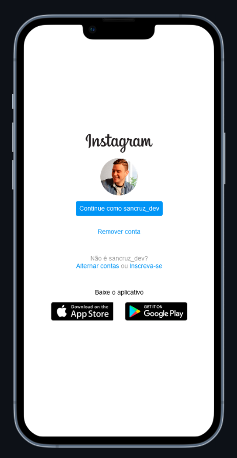

# Sancruz - Clonando Interface do Instagram

> Esse é o repositório da aula de Flexbox, na qual foi feita a interface de login do Instagram! 

  

  

***

### Minhas Alterações

Logo abaixo estão listadas as principais modificações realizadas.

#### Semântica

- Tags subtituidoras: `main`, `figure`, `button` e `a`;
- Hierarquia CSS: Ajustando as classes dos elementos para o conceito hierárquico CSS, oferecendo melhor descrição às classes e esclarecendo quem são os _elementos-pai_ e _elementos-filho_;
- Alt e title: Aprimorando as descrições/conteúdos para melhor experiência e acessibilidade;

#### Ajustes:

- Funcionalidade aos elementos: "alternar contas" e "Inscreva-se". Ambos eram spans e sem nenhuma interação, e depois da alteração foram tranformados em âncoras funcionais;

#### Adições:

- Arquitetura de pastas: pela ideia de organização e padrões, foi adicionado a pasta assets ao diretório, e após isso, movido a pasta de imagens e o arquivo de estilo;
- Pseudo-classes: hover e active aos links de âncoras e botões;
- Favicon na aba da página;

