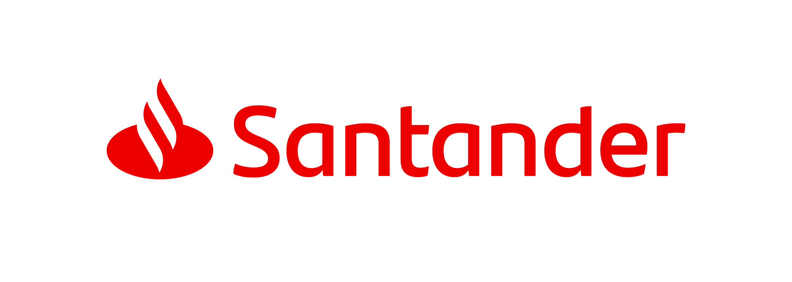

   
   
   

# Presentation
This repository is part of the bootcamp ["Hiring Coders #3"](https://www.hiringcoders.com.br/). 
The projects and activities developed along this course will be available here. 
You are invited to use the codes and improve them. It will be great if you have comments or suggestions to make them better. 

## Tecnologies And Tools

# Oi, tudo bem? Chegou aqui através do curso, certo? 🙃

Esse é o repositório da nossa aula de Flexbox, na qual vamos fazer a interface de login do Instagram! 

### Os requisitos são:

* [HTML básico](https://www.w3schools.com/html/)
* [CSS básico](https://developer.mozilla.org/pt-BR/docs/Web/CSS)

## 🚀 Let's code! 🚀
